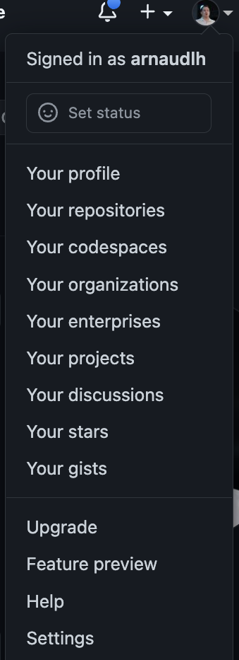
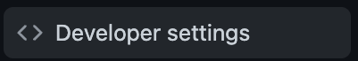
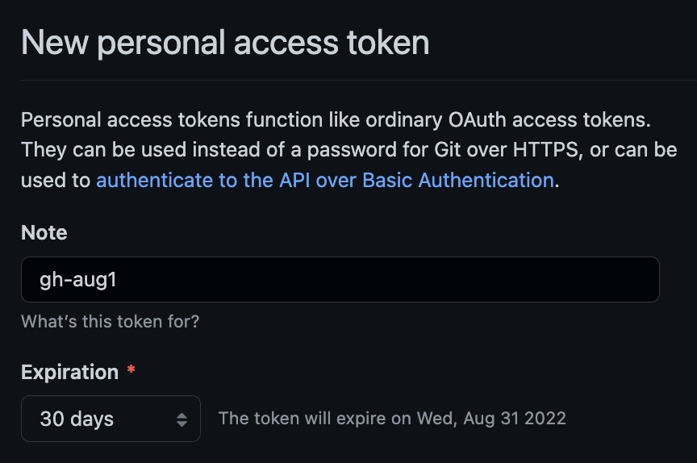
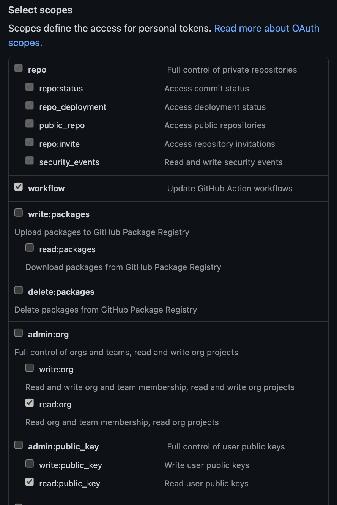
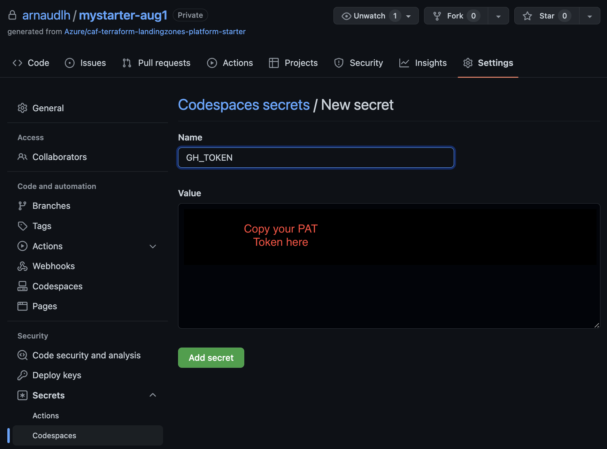

# Deployment through GitHub Actions workflows

## Deployment from GitHub Codespaces

### Create a PAT token

From your **Github profile** go to **Settings** and select at the botton **Developer settings**




Select **Personal access tokens** and click **Generate new token**



Set the Expiration date to desired value.

Select the following scopes:
- repo
- workflow
- read:public_key
- read:org



Scroll-down and click **Generate token**

Copy the value of the PAT token.

Go to the settings of your project and under the **Secrets** menu select **Codespaces**

Select **New repository secret**

Name the secret **GH_TOKEN** and paste the value



If Codespaces was already started when you added the GH_TOKEN, restart the Codespaces to get the GH_TOKEN injected into the Codespaces environment.

### Deploy from Codespaces

Once Codespaces has launched,login to Azure

```
rover login -t <tenant_name> -s <subscription_id>

```

The following command assumes you have Global Admin in the tenant_name and granted Owner privileges on the management subscription ```<guid for management>```

```
org_name=contoso

rover -bootstrap \
  -aad-app-name ${org_name}-platform-landing-zones \
  -env ${org_name} \
  -gitops-pipelines github \
  -gitops-number-runners 6 \
  -bootstrap-script '/tf/caf/landingzones/templates/platform/deploy_platform.sh' \
  -playbook '/tf/caf/landingzones/templates/platform/caf_platform_prod_nonprod.yaml' \
  -subscription-deployment-mode multi_subscriptions \
  -sub-management <guid for management> \
  -sub-connectivity <guid for connectivity> \
  -sub-identity <guid for identity> \
  -sub-security <guid for security>

```